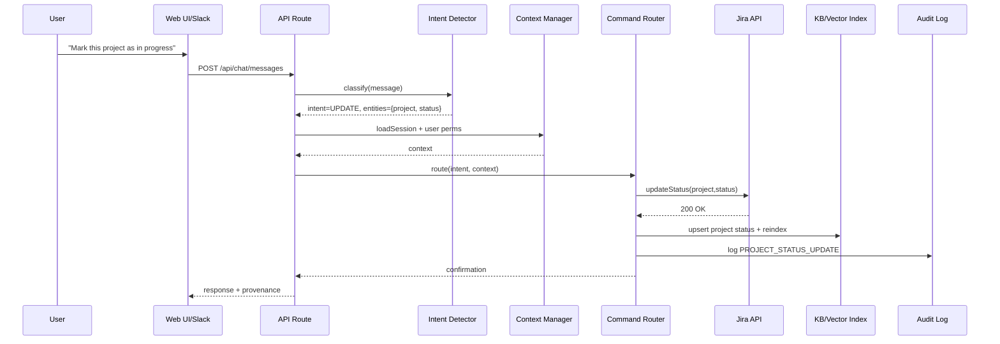
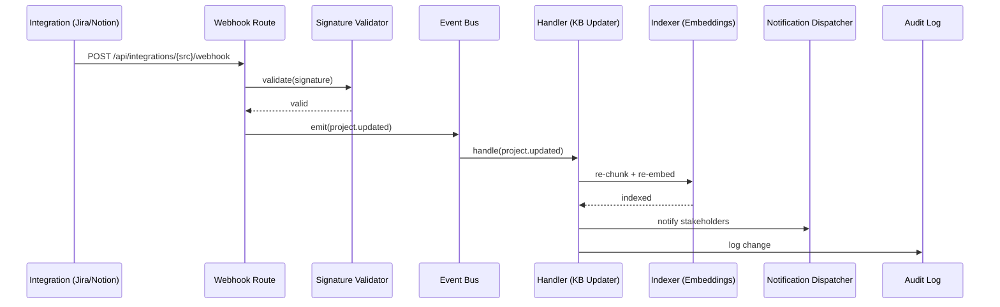

# Functional Flow - AI Communication Hub

## User Input to AI Response Flow

### Update Command Flow (Mermaid)



### 1. User Input Processing
```
User Types: "Mark this project as in progress"
     ↓
┌─────────────────────────────────────────────────────────────────┐
│                    INPUT VALIDATION                            │
├─────────────────────────────────────────────────────────────────┤
│  • Sanitize input text                                         │
│  • Check for malicious content                                 │
│  • Validate user permissions                                   │
│  • Extract user context (department, role, current project)    │
└─────────────────────────────────────────────────────────────────┘
     ↓
┌─────────────────────────────────────────────────────────────────┐
│                   INTENT DETECTION                             │
├─────────────────────────────────────────────────────────────────┤
│  • Classify intent: UPDATE, QUERY, NOTIFY, or CHAT            │
│  • Extract entities: "project", "in progress"                 │
│  • Determine action type: Project Management Update            │
│  • Confidence score: 0.95                                     │
└─────────────────────────────────────────────────────────────────┘
```

### 2. Context Analysis & Memory Management
```
     ↓
┌─────────────────────────────────────────────────────────────────┐
│                 CONTEXT MANAGER                                │
├─────────────────────────────────────────────────────────────────┤
│  • Retrieve user session history                               │
│  • Load current project context                                │
│  • Check recent interactions                                   │
│  • Validate user has access to target project                 │
│  • Load project metadata and current status                    │
└─────────────────────────────────────────────────────────────────┘
     ↓
┌─────────────────────────────────────────────────────────────────┐
│                 COMMAND ROUTER                                 │
├─────────────────────────────────────────────────────────────────┤
│  Intent: UPDATE                                                │
│  Action: Project Status Change                                 │
│  Target: Jira Integration                                      │
│  Permissions: ✓ User has write access to project              │
│  Route: → Integration Layer → Jira API                        │
└─────────────────────────────────────────────────────────────────┘
```

### 3. Integration & Update Processing
```
     ↓
┌─────────────────────────────────────────────────────────────────┐
│                 JIRA INTEGRATION                               │
├─────────────────────────────────────────────────────────────────┤
│  • Authenticate with Jira API                                  │
│  • Find project by context/name                                │
│  • Update status to "In Progress"                              │
│  • Add comment: "Status updated via AI Hub"                    │
│  • Return success confirmation                                 │
└─────────────────────────────────────────────────────────────────┘
     ↓
┌─────────────────────────────────────────────────────────────────┐
│                 KNOWLEDGE BASE UPDATE                          │
├─────────────────────────────────────────────────────────────────┤
│  • Update project status in local KB                           │
│  • Re-index project document                                   │
│  • Update vector embeddings                                    │
│  • Trigger notification to project team                        │
│  • Log change in audit system                                  │
└─────────────────────────────────────────────────────────────────┘
```

### 4. Response Generation & Delivery
```
     ↓
┌─────────────────────────────────────────────────────────────────┐
│                 RESPONSE GENERATOR                             │
├─────────────────────────────────────────────────────────────────┤
│  • Generate confirmation message                               │
│  • Include project details and new status                      │
│  • Add relevant context and next steps                         │
│  • Format with markdown and styling                            │
│  • Include provenance: "Updated via Jira API"                 │
└─────────────────────────────────────────────────────────────────┘
     ↓
┌─────────────────────────────────────────────────────────────────┐
│                 UI UPDATE & NOTIFICATION                       │
├─────────────────────────────────────────────────────────────────┤
│  • Update chat interface with response                         │
│  • Send real-time notification to project team                 │
│  • Update right panel with project status change               │
│  • Log interaction in audit system                             │
│  • Store in conversation history                               │
└─────────────────────────────────────────────────────────────────┘
```

## Query Processing Flow

### Query Flow (Mermaid)

```mermaid
flowchart TD
  A[User asks: "Is the new policy live?"] --> B[Intent: QUERY]
  B --> C[Build query embedding]
  C --> D{Retriever}
  D -->|Vector search| E[Vector DB (pgvector/Pinecone)]
  D -->|Filters| F[RBAC filter by department/access]
  E --> G[Rank by similarity, recency, authority]
  G --> H[Assemble context window]
  H --> I[LLM Generation with grounding]
  I --> J[Add provenance citations]
  J --> K[Return concise, professional answer]
```

### Example: "Is the new policy live?"

```
User Input: "Is the new policy live?"
     ↓
┌─────────────────────────────────────────────────────────────────┐
│                   INTENT DETECTION                             │
├─────────────────────────────────────────────────────────────────┤
│  Intent: QUERY                                                 │
│  Entities: ["new policy", "live"]                              │
│  Action: Information Retrieval                                 │
│  Confidence: 0.92                                              │
└─────────────────────────────────────────────────────────────────┘
     ↓
┌─────────────────────────────────────────────────────────────────┐
│                   RAG PIPELINE                                 │
├─────────────────────────────────────────────────────────────────┤
│  • Generate query embedding                                    │
│  • Search vector store for policy documents                    │
│  • Retrieve top 5 relevant chunks                             │
│  • Rank by relevance and recency                              │
│  • Filter by user permissions                                 │
└─────────────────────────────────────────────────────────────────┘
     ↓
┌─────────────────────────────────────────────────────────────────┐
│                 CONTEXT ENRICHMENT                             │
├─────────────────────────────────────────────────────────────────┤
│  • Load policy metadata (version, effective date)              │
│  • Check deployment status                                     │
│  • Verify current active policies                              │
│  • Cross-reference with HR systems                            │
└─────────────────────────────────────────────────────────────────┘
     ↓
┌─────────────────────────────────────────────────────────────────┐
│                 LLM GENERATION                                 │
├─────────────────────────────────────────────────────────────────┤
│  • Combine retrieved context with user query                   │
│  • Generate grounded response                                  │
│  • Include specific policy details and dates                   │
│  • Add source citations                                        │
│  • Ensure factual accuracy                                     │
└─────────────────────────────────────────────────────────────────┘
     ↓
┌─────────────────────────────────────────────────────────────────┐
│                 RESPONSE DELIVERY                              │
├─────────────────────────────────────────────────────────────────┤
│  Response: "Yes, the new remote work policy (v2.1) went live  │
│  on March 15th. It includes updated guidelines for hybrid     │
│  schedules and equipment reimbursement. [Source: HR_Policy_    │
│  Remote_Work_v2.1.pdf, last updated March 14th]"              │
└─────────────────────────────────────────────────────────────────┘
```

## Event-Driven Update Flow

### Webhook/Events (Mermaid)



### Example: Jira Webhook Received

```
Jira Webhook: Project status changed to "Completed"
     ↓
┌─────────────────────────────────────────────────────────────────┐
│                 WEBHOOK PROCESSOR                              │
├─────────────────────────────────────────────────────────────────┤
│  • Validate webhook signature                                  │
│  • Parse payload and extract changes                           │
│  • Identify affected project and team                          │
│  • Queue for processing                                        │
└─────────────────────────────────────────────────────────────────┘
     ↓
┌─────────────────────────────────────────────────────────────────┐
│                 EVENT HANDLER                                  │
├─────────────────────────────────────────────────────────────────┤
│  • Update local knowledge base                                 │
│  • Re-index project documents                                  │
│  • Update vector embeddings                                    │
│  • Trigger notifications                                       │
│  • Log audit trail                                            │
└─────────────────────────────────────────────────────────────────┘
     ↓
┌─────────────────────────────────────────────────────────────────┐
│                 NOTIFICATION DISPATCHER                        │
├─────────────────────────────────────────────────────────────────┤
│  • Identify stakeholders (project team, managers)              │
│  • Generate personalized notifications                         │
│  • Send via multiple channels (in-app, email, Slack)          │
│  • Update real-time dashboard                                  │
└─────────────────────────────────────────────────────────────────┘
```

## Error Handling & Fallback Flow

```
Error Detected: Jira API unavailable
     ↓
┌─────────────────────────────────────────────────────────────────┐
│                 ERROR HANDLER                                  │
├─────────────────────────────────────────────────────────────────┤
│  • Log error with context                                      │
│  • Attempt retry with exponential backoff                      │
│  • If retry fails, queue for later processing                  │
│  • Notify user of temporary limitation                         │
│  • Provide alternative actions                                 │
└─────────────────────────────────────────────────────────────────┘
     ↓
┌─────────────────────────────────────────────────────────────────┐
│                 FALLBACK RESPONSE                              │
├─────────────────────────────────────────────────────────────────┤
│  Response: "I'm having trouble connecting to Jira right now.   │
│  I've queued your request and will process it as soon as the   │
│  connection is restored. In the meantime, you can check the    │
│  project status directly in Jira or try again in a few minutes."│
└─────────────────────────────────────────────────────────────────┘
```

## Performance Optimization Flow

```
High-Load Scenario: Multiple concurrent queries
     ↓
┌─────────────────────────────────────────────────────────────────┐
│                 LOAD BALANCER                                  │
├─────────────────────────────────────────────────────────────────┤
│  • Distribute requests across multiple RAG instances           │
│  • Cache frequent queries                                      │
│  • Prioritize urgent requests                                  │
│  • Queue non-critical updates                                  │
└─────────────────────────────────────────────────────────────────┘
     ↓
┌─────────────────────────────────────────────────────────────────┐
│                 CACHE LAYER                                    │
├─────────────────────────────────────────────────────────────────┤
│  • Redis cache for frequent queries                            │
│  • CDN for static responses                                    │
│  • In-memory cache for user sessions                           │
│  • Vector cache for similar queries                            │
└─────────────────────────────────────────────────────────────────┘
```

## Security & Compliance Flow

```
Every Request: Security validation
     ↓
┌─────────────────────────────────────────────────────────────────┐
│                 SECURITY MIDDLEWARE                            │
├─────────────────────────────────────────────────────────────────┤
│  • Validate JWT token                                          │
│  • Check user permissions                                      │
│  • Rate limiting                                               │
│  • Input sanitization                                          │
│  • Audit logging                                               │
└─────────────────────────────────────────────────────────────────┘
     ↓
┌─────────────────────────────────────────────────────────────────┐
│                 DATA PRIVACY                                   │
├─────────────────────────────────────────────────────────────────┤
│  • Encrypt sensitive data                                      │
│  • Mask PII in logs                                            │
│  • Ensure data residency                                       │
│  • Apply retention policies                                    │
│  • GDPR compliance checks                                      │
└─────────────────────────────────────────────────────────────────┘
```
