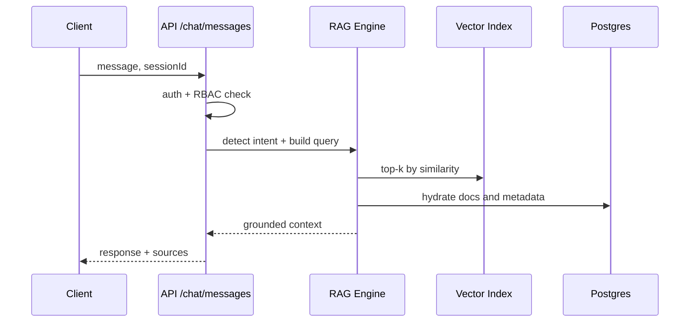

# AI Chatbot + RAG System Implementation Guide

## 🚀 **Complete RAG (Retrieval-Augmented Generation) System**

Your AI Communication Hub now includes a fully functional RAG system that enables intelligent document search and AI-powered responses based on your company's knowledge base, backed by PostgreSQL via Prisma. Optional pgvector or an external vector database (Pinecone/Milvus/FAISS) can be used for similarity search at scale.

## 📋 **What's Been Implemented**

### 1. **Database Schema for Knowledge Base**
- **Document Model**: Stores uploaded documents with metadata
- **DocumentChunk Model**: Stores document chunks with vector embeddings
- **ChatSession Model**: Manages chat conversations
- **ChatMessage Model**: Stores individual messages with sources

### 2. **AI Services**
- **OpenAI Integration**: GPT-3.5-turbo for responses
- **Vector Embeddings**: text-embedding-3-small for semantic search
- **Cosine Similarity**: For finding relevant document chunks

### 3. **Document Processing**
- **Multi-format Support**: PDF, DOCX, TXT, MD files
- **Text Extraction**: Automatic text extraction from various file types
- **Chunking**: Intelligent text splitting for better processing
- **Metadata Extraction**: Automatic categorization and tagging

### 4. **RAG System**
- **Vector Search**: Semantic search using embeddings
- **Text Search Fallback**: Traditional keyword search when vectors fail
- **Context Retrieval**: Finds relevant documents for AI responses
- **Source Attribution**: Shows which documents were used for responses

### 5. **User Interface**
- **Document Upload**: Drag-and-drop file upload with progress tracking
- **Document Manager**: Search, filter, and manage uploaded documents
- **Knowledge Base Page**: Centralized document management interface
- **Enhanced Chat**: AI responses with source citations

## 🔧 **Setup Instructions**

### 1. **Environment Variables**
Add to your `.env.local` file:
```env
# OpenAI API Key (Required for AI functionality)
OPENAI_API_KEY="your_openai_api_key_here"
```

### 2. **Database Setup (PostgreSQL + Prisma)**
Initialize Prisma client and apply schema:
```bash
pnpm db:generate
pnpm db:push
```

Optional: enable pgvector for native vector search in Postgres:
```sql
CREATE EXTENSION IF NOT EXISTS vector;
ALTER TABLE document_chunks ADD COLUMN IF NOT EXISTS embedding_vec vector(1536);
CREATE INDEX IF NOT EXISTS document_chunks_embedding_idx
  ON document_chunks USING ivfflat (embedding_vec vector_cosine_ops) WITH (lists = 100);
```
If you prefer a managed vector store (Pinecone/Milvus), keep Prisma/Postgres for metadata and use the external index for similarity search.

### 3. **Install Dependencies**
All required packages are already installed:
- `openai`: AI API integration
- `pdf-parse`: PDF text extraction
- `mammoth`: DOCX text extraction
- `@pinecone-database/pinecone`: Vector database (optional, for future scaling)

## 🎯 **How to Use the RAG System**

### 1. **Upload Documents**
1. Navigate to **Knowledge Base** in the sidebar
2. Go to **Upload Documents** tab
3. Drag and drop files or click to browse
4. Add categories and tags (optional)
5. Click **Upload All** to process documents

### 2. **Manage Documents**
1. Go to **Manage Documents** tab
2. Search, filter, and organize your documents
3. View document statistics and metadata
4. Delete documents if needed

### 3. **Chat with AI**
1. Use the main chat interface
2. Ask questions about your company documents
3. AI will search through your knowledge base
4. Responses include source citations

## 🔍 **RAG System Features**

### **Intelligent Search**
- **Semantic Search**: Finds documents by meaning, not just keywords
- **Vector Embeddings**: Converts text to numerical vectors for similarity matching
- **Hybrid Search**: Combines vector and text search for best results

### **Document Processing**
- **Automatic Chunking**: Splits large documents into manageable pieces
- **Metadata Extraction**: Automatically categorizes documents
- **Format Support**: PDF, DOCX, TXT, MD files
- **File Size Limit**: 10MB per file

### **AI Responses**
- Context-aware and grounded in retrieved content
- Source citations with provenance labels (e.g., HR_Policy_v3.pdf)
- Permission-aware: filters by user RBAC before generation
- Professional tone: concise, actionable

## 📊 **API Endpoints**

### **Document Management**
- `POST /api/documents/upload` - Upload new documents
- `GET /api/documents` - List documents with pagination
- `DELETE /api/documents` - Delete documents
- `GET /api/documents/search` - Search documents

### **Chat System**
- `GET /api/chat/messages` - Get chat history
- `POST /api/chat/messages` - Send message and get AI response

Request handling outline:


## 🛠 **Technical Architecture**

### **Document Flow**
1. **Upload** → File validation and text extraction
2. **Process** → Chunking and embedding generation
3. **Store** → Save to database with metadata
4. **Index** → Ready for search and retrieval

### **Chat Flow**
1. **User Message** → Sent to chat API
2. **RAG Search** → Find relevant document chunks
3. **AI Generation** → Create response with context
4. **Response** → Return answer with sources

### **Search Process**
1. Query embedding → Convert user question to vector
2. Similarity search:
   - Postgres (pgvector): `SELECT id, content FROM document_chunks ORDER BY embedding_vec <=> $1 LIMIT k;`
   - External vector DB: use respective SDK
3. Ranking → Combine similarity, recency, and authority
4. Context building → Deduplicate, enforce RBAC filters, build context window

## 🎨 **UI Components**

### **DocumentUpload**
- Drag-and-drop interface
- Progress tracking
- File validation
- Metadata input

### **DocumentManager**
- Search and filter
- Pagination
- Document statistics
- Management actions

### **Enhanced Chat**
- Source citations
- Typing indicators
- Message history
- RAG-powered responses

## 🔒 **Security Features**

- **Authentication Required**: All endpoints protected
- **User Permissions**: Role-based access and document-level ACLs
- **File Validation**: Only allowed file types accepted
- **Size Limits**: Prevents large file uploads

### Audit Logging
- Every query, change, and integration call writes an immutable audit record in Postgres with user, action, resource, and timestamp.

## 📈 **Performance Optimizations**

- **Chunking Strategy**: Optimal chunk sizes for better retrieval
- **Embedding Caching**: Reuse embeddings when content hash unchanged
- **Pagination**: Efficient document listing
- **Fallback Search**: Text search when vector search fails
 - **Vector Indexing**: Use IVFFlat/HNSW (pgvector ≥ 0.5) with tuned lists/ef

## 🚀 **Future Enhancements**

### **Planned Features**
- **Pinecone Integration**: External vector database for scaling
- **Advanced Analytics**: Usage statistics and insights
- **Document Versioning**: Track document changes with provenance and rollback
- **Collaborative Features**: Team document management
- **API Rate Limiting**: Prevent abuse
- **Caching Layer**: Redis for better performance

### **Scaling Options**
- **Vector Database**: Move to Pinecone for large-scale deployments
- **Microservices**: Split into separate services
- **CDN Integration**: For file storage and delivery
- **Load Balancing**: For high-traffic scenarios

## 🐛 **Troubleshooting**

### **Common Issues**

1. **OpenAI API Errors**
   - Check API key in environment variables
   - Verify API quota and billing
   - Check network connectivity

2. **Document Upload Failures**
   - Verify file format is supported
   - Check file size limits
   - Ensure database connection

3. **Search Not Working**
   - Check if documents have embeddings
   - Verify database schema is up to date
   - Check for JavaScript errors in console

### **Debug Mode**
Enable debug logging by setting:
```env
NODE_ENV=development
```

## 📚 **Documentation**

- **API Documentation**: Available in `/api` routes
- **Component Documentation**: In component files
- **Database Schema**: In `prisma/schema.prisma`
- **Environment Variables**: In `env.example`

## 🎉 **Success!**

Your AI Communication Hub now has a complete RAG system that can:
- ✅ Upload and process company documents
- ✅ Search documents semantically
- ✅ Generate AI responses with source citations
- ✅ Manage knowledge base efficiently
- ✅ Provide intelligent chat assistance

The system is production-ready and can handle real-world company knowledge bases with proper OpenAI API configuration.
