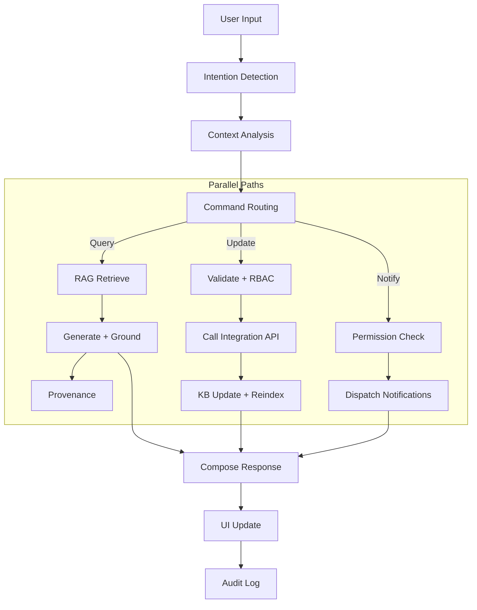

# Internal Company AI Communication Hub - System Architecture

## Overview
A private, intelligent, always-updated communication broker that replaces internal emails, keeps all company knowledge current, and provides instant, accurate answers to any employee query using RAG (Retrieval-Augmented Generation).

## System Architecture Diagram

```mermaid
flowchart LR
  subgraph UI[User Interface Layer]
    A1[Left Panel\nTeams/Projects/Shortcuts]
    A2[Center Panel\nChat + Threads + History]
    A3[Right Panel\nInsights/Statuses/Notifications]
  end

  subgraph API[App/API Layer (Next.js Routes)]
    B1[Auth Middleware\nSSO/OAuth2]
    B2[Chat Controller]
    B3[Webhook Controller]
  end

  subgraph CORE[Processing & Logic Layer]
    C1[Intent Detector]
    C2[Context Manager]
    C3[Command Router]
    C4[Event Bus]
  end

  subgraph RAG[RAG Engine]
    D1[Document Processor]
    D2[Retriever]
    D3[Response Generator\nGrounding + Provenance]
  end

  subgraph DATA[Knowledge Base]
    E1[(PostgreSQL via Prisma)]
    E2[[Vector Index\npgvector or Pinecone/Milvus/FAISS]]
  end

  subgraph INTEG[Integrations]
    F1[Jira]
    F2[Notion/Confluence]
    F3[Slack/Teams]
    F4[HR/IT Systems]
  end

  subgraph SEC[Security]
    G1[RBAC\nRole/Permission Matrix]
    G2[Audit Logs]
    G3[TLS 1.3 + AES-256 at rest]
  end

  UI -->|HTTPS| B1
  B1 --> B2
  B2 --> C1 --> C2 --> C3
  C3 -->|Query| D2 --> E2
  D2 --> D3 --> B2 --> UI
  C3 -->|Update| INTEG
  INTEG -->|Webhooks| B3 --> C4 --> D1 --> E1 & E2
  C3 -.notify.-> UI
  C1 & C2 & C3 --> G2
  B1 --> G1
```

## Data Flow Architecture



## Event-Driven Architecture

```
┌─────────────────────────────────────────────────────────────────┐
│                        EVENT BUS                                │
├─────────────────────────────────────────────────────────────────┤
│  • Document Updated    • Project Status Changed                │
│  • Policy Modified     • New Employee Added                     │
│  • Meeting Scheduled   • Integration Webhook Received           │
│  • User Query          • System Alert Triggered                 │
└─────────────────────────────────────────────────────────────────┘
                              │
                              ▼
┌─────────────────────────────────────────────────────────────────┐
│                    EVENT HANDLERS                               │
├─────────────────────────────────────────────────────────────────┤
│  • Knowledge Base Updater  • Notification Dispatcher           │
│  • Vector Index Rebuilder  • Integration Sync Manager          │
│  • Permission Validator    • Audit Logger                      │
└─────────────────────────────────────────────────────────────────┘
```

## Prisma/PostgreSQL Schema (RBAC, Audit, RAG)

Use PostgreSQL via Prisma for structured data and pgvector (or external vector DB) for embeddings.

```prisma
// RBAC
model Role {
  id          String   @id @default(cuid())
  name        String   @unique
  description String?
  users       UserRole[]
  permissions RolePermission[]
  createdAt   DateTime @default(now())
  updatedAt   DateTime @updatedAt
}

model Permission {
  id          String   @id @default(cuid())
  name        String   @unique
  description String?
  roles       RolePermission[]
}

model UserRole {
  id     String @id @default(cuid())
  user   User   @relation(fields: [userId], references: [id], onDelete: Cascade)
  userId String
  role   Role   @relation(fields: [roleId], references: [id], onDelete: Cascade)
  roleId String
  @@unique([userId, roleId])
}

model RolePermission {
  id           String     @id @default(cuid())
  role         Role       @relation(fields: [roleId], references: [id], onDelete: Cascade)
  roleId       String
  permission   Permission @relation(fields: [permissionId], references: [id], onDelete: Cascade)
  permissionId String
  @@unique([roleId, permissionId])
}

// Audit
model AuditLog {
  id           String   @id @default(cuid())
  user         User?    @relation(fields: [userId], references: [id])
  userId       String?
  action       String
  resourceType String?
  resourceId   String?
  details      Json?
  ipAddress    String?
  userAgent    String?
  createdAt    DateTime @default(now())
}

// Integrations
model IntegrationConfig {
  id              String   @id @default(cuid())
  integrationType String
  config          Json
  isActive        Boolean  @default(true)
  createdAt       DateTime @default(now())
  updatedAt       DateTime @updatedAt
}

model WebhookEvent {
  id         String   @id @default(cuid())
  source     String
  payload    Json
  receivedAt DateTime @default(now())
  handledAt  DateTime?
  status     String   @default("pending")
}

// Knowledge Base (embeddings can live in pgvector or external vector DB)
model Document {
  id          String   @id @default(cuid())
  title       String
  content     String
  source      String?
  documentType String?
  department  String?
  accessLevel Int      @default(1)
  version     Int      @default(1)
  metadata    Json?
  createdAt   DateTime @default(now())
  updatedAt   DateTime @updatedAt
  chunks      DocumentChunk[]
}

model DocumentChunk {
  id         String   @id @default(cuid())
  document   Document @relation(fields: [documentId], references: [id], onDelete: Cascade)
  documentId String
  content    String
  chunkIndex Int
  // Option A (current): store embedding as JSON (portable)
  embedding  Json?
  // Option B (preferred for speed): pgvector column via native type or migration
  // embeddingVec Unsupported("vector")? @db.Vector(1536)
  metadata   Json?
  createdAt  DateTime @default(now())
}
```

To enable pgvector in PostgreSQL:

```sql
CREATE EXTENSION IF NOT EXISTS vector;
-- Example: ALTER TABLE document_chunks ADD COLUMN embedding_vec vector(1536);
-- Create IVF or HNSW index depending on workload
CREATE INDEX IF NOT EXISTS idx_document_chunks_embedding_hnsw
  ON document_chunks USING hnsw (embedding_vec vector_l2_ops);
```

## Technology Stack

### Frontend
- **Framework**: Next.js 15 with React 19
- **Styling**: Tailwind CSS with custom white/purple theme
- **State Management**: Zustand or Redux Toolkit
- **Real-time**: WebSocket connections for live updates
- **UI Components**: Custom components with Framer Motion animations

### Backend
- **API**: Next.js API routes with tRPC for type-safe APIs
- **Database**: PostgreSQL for structured data, Redis for caching
- **Vector Store**: Pinecone or Milvus for embeddings
- **LLM**: OpenAI GPT-4 or Anthropic Claude for RAG
- **Authentication**: NextAuth.js with company SSO

### Infrastructure
- **Deployment**: Docker containers on Kubernetes
- **Monitoring**: Prometheus + Grafana
- **Logging**: ELK Stack (Elasticsearch, Logstash, Kibana)
- **Security**: Vault for secrets management
